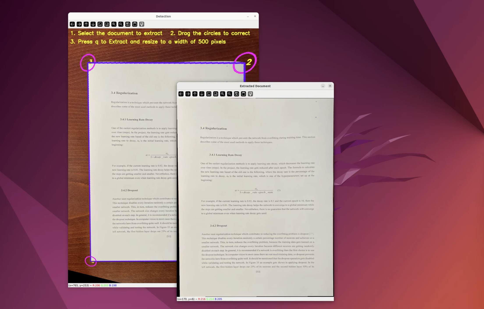

# Document Scanner

## Description
This document scanner can be used to extract a document from an image by applying perspective transformation and cutting off the black border. Before extracting the document, the approximated corners can be modified by the user. The application was developed using Python and the OpenCV library.

## Video

