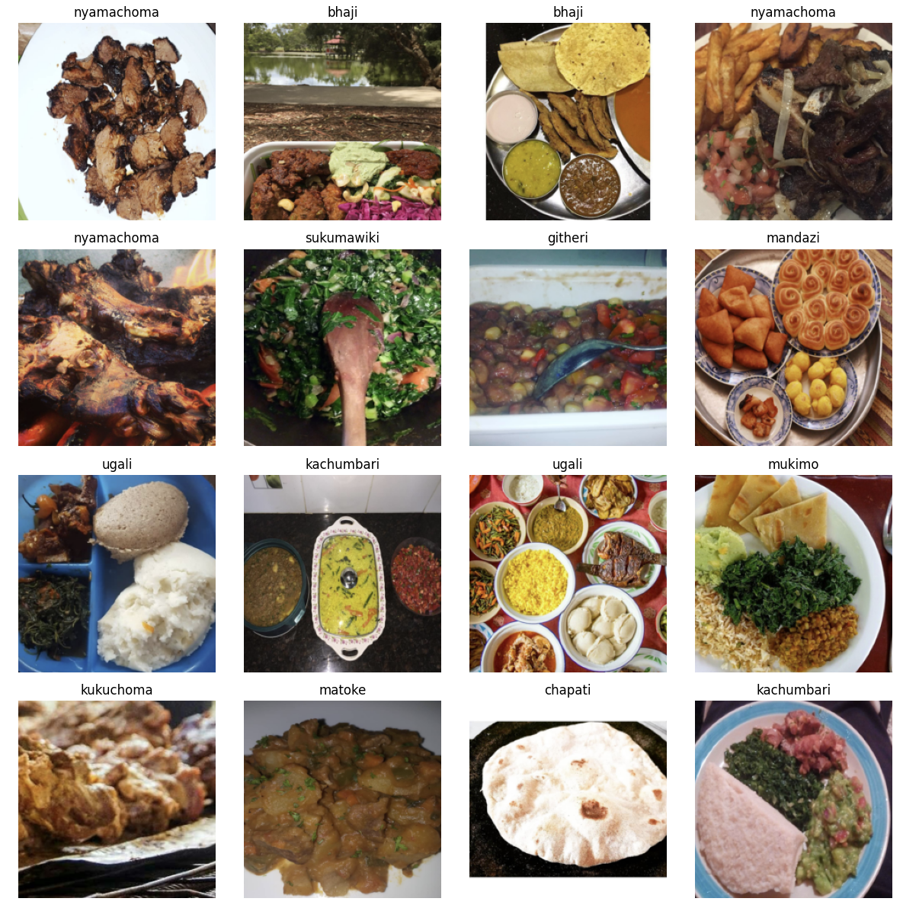
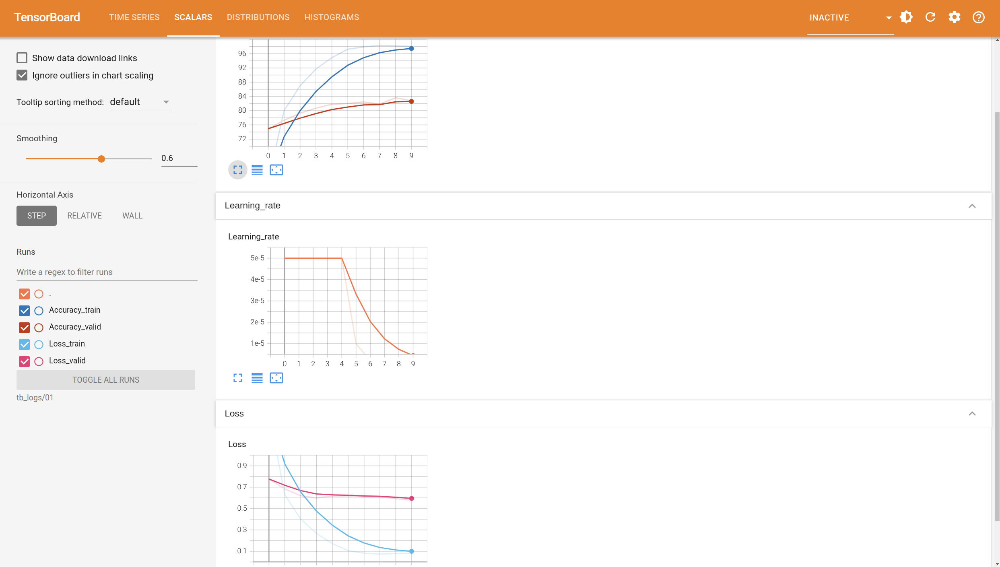
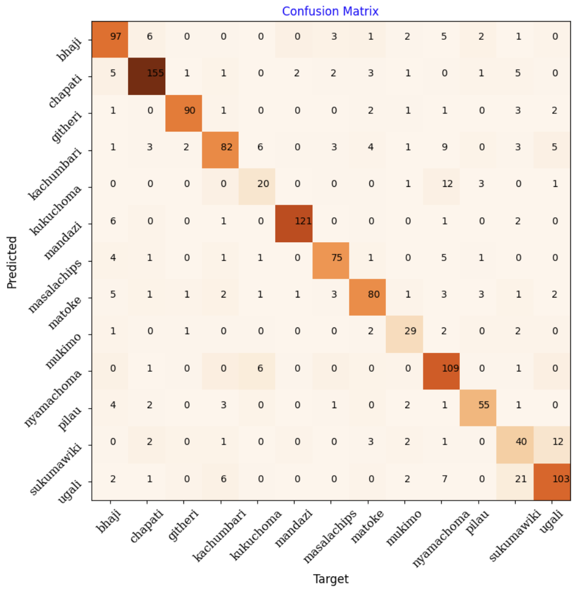

# Indian Meal Classification

## Description
This project was created based on a **Classification Competition of Kaggle**, which I started in July 2024 and completed in the same month in my free time. At the end I achieved the first place from 21 contestants in the Leaderboard with a score of 79,829% in accuracy. Therefore, I hope you understand that it is not allowed to share the overall code and so I had to remove important code parts to share the project on a public repository (i.e. showing my consideration to complete the project). Places where code has been removed are marked with ### CODE REMOVED and important settings with three successive dots. So please keep in mind that not every code block is executable. Nevertheless, I left most of the outputs in the notebook, so you can see which steps I followed to complete the project. Thank you for your understanding.

## Steps
In order to participate to the contest, at first I had to create a dataset consisted of training, validation and test images, using the given 8174 RGB images containing different indian meals. In the following, the dataset was used for the training process on a pre-trained model, which was modified by adding Dropout modules on certain layers. To stop the training process when the validation loss did not sunk after specific epochs, the Early Stopping algorithm was applied. The purpose of the training process was to classify images into thirteen classes of indian meals. After ending the process the created test set was utilized to predict images. The overall process was logged in TensorBoard.

## Development
- Development environment: Jupyter Notebook/Lab, PyCharm
- Programming language: Python
- Deep Learning Library: PyTorch (including Torchvision)
- Logging libraries: Matplotlib, TensorBoard
- Experimented with followin CNN's: ResNet, ConvNeXt, Inception, VGG, Swin Transformer
- Other important libraries: NumPy, Pandas, PIL

## Screenshots

### Images of the Dataset

### Training Result

### Prediction Result
